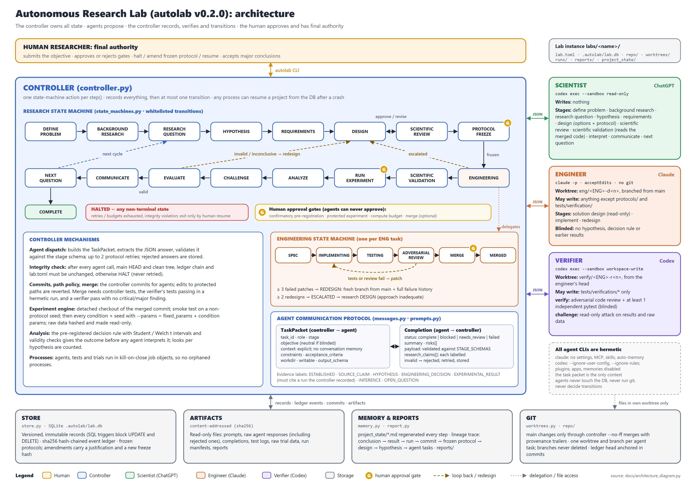

# Autonomous Research Lab — Architecture

Status labels follow the project evidence taxonomy. Unless marked otherwise,
statements below are **ENGINEERING_DECISION**s describing what is implemented
in `src/autolab/`.

---

## 1. System architecture



_Diagram: `docs/architecture.png` / `.svg`, generated by `python docs/architecture_diagram.py`; update it with this document._

```text
                         HUMAN RESEARCHER
          objective · approvals · resume · final authority
                               │  autolab CLI
                               ▼
┌──────────────────────────── CONTROLLER (controller.py) ───────────────────────────┐
│  owns authoritative state · one state-machine action per step() · gates · retries │
│                                                                                    │
│  Research SM ◄──────────► Engineering SM        Experiment engine  Report builder │
│  (state_machines.py)      (per ENG task)        (experiments.py)   (report.py)    │
│        │                        │                       │                          │
│        ▼                        ▼                       ▼                          │
│  Agent dispatch ──────► TaskPacket ──► Agent ──► Completion (schema-validated)    │
│  (agents.py, messages.py, prompts.py)                                             │
└───────┬───────────────────────┬───────────────────────┬──────────────────────────┘
        │                       │                       │
   STORE (store.py)       GIT (worktrees.py)      ARTIFACTS (store.py)
   SQLite: versioned      repo/ main = integration content-addressed sha256,
   records + hash-chained per-agent worktrees     read-only raw data, prompts,
   event ledger           + branches               logs, manifests, reports
        │
   MEMORY (memory.py): typed views, lineage trace, project_state/*.md export
```

| Agent | Default backend | Workspace | May write |
|---|---|---|---|
| Scientist (ChatGPT) | `codex-cli` read-only (ChatGPT login) or `openai-api` | none | nothing |
| Engineer (Claude) | `claude-cli` (`claude -p`, acceptEdits, git disallowed) | `worktrees/engineer/<ENG>-d<n>` | anything except protected paths |
| Verifier (Codex) | `codex-cli` `--sandbox workspace-write` | `worktrees/verifier/<ENG>-r<n>` | `tests/verification/*` only |

Agents never touch the database, never run git and never decide transitions.
Agent CLIs run hermetically (no user settings, CLAUDE.md, plugins, skills, MCP servers or
memories): the task packet is their only context. The engineer and the verifier (verify
stage) are blinded to the hypothesis, decision rule and earlier results. After every agent
call the controller checks that controller-owned state (main checkout, ledger, lab.toml)
is unchanged, and HALTs on any change (the engineer runs Python outside an OS sandbox).

## 2. Agent architecture

* `AgentBackend.invoke(task, prompt) -> text` (transport only):
  `ClaudeCLIBackend`, `CodexCLIBackend`, `OpenAIBackend`, `ScriptedBackend`
  (deterministic, for tests and the offline demo).
* `Agent.run(task)` builds the prompt (common rules + role charter + stage
  instructions + task packet + output schema, `prompts.py`), extracts the JSON
  object from the response, validates it against the stage schema and retries
  up to `max_protocol_retries` times with the validation error. Anything not
  schema-valid never reaches the controller's state.
* Role → stage responsibilities:
  * Scientist: define_problem, background_research, research_question,
    hypothesis, requirements, design (brainstorm/evaluate/choose + protocol),
    scientific_review, scientific_validation, interpret, communicate,
    next_question.
  * Engineer: solution_design (feasibility, read-only), implement, redesign.
  * Verifier: verify (adversarial code review + independent tests), challenge
    (adversarial review of results).
* The scientific review is a *separate* scientist call with a reviewer
  framing. OPEN_QUESTION: whether a different model should review (configure
  a different backend/model to test this).

### 2a. Agent registry and stage allocation (D52)

Roles are **permission classes** fixed per stage (`registry.STAGES`: 18 stages with role,
plane, writable, reads-files). **Agents** are named configurations: backend (`claude-cli`,
`codex-cli`, `gemini-cli`, `openai-api`; capabilities in `registry.BACKENDS`), model, optional
title, charter, effort, timeout and backup backend/model. `[allocation]` maps a stage to an
agent; an unallocated stage runs on the agent named after its role.

```toml
# agents.toml (lab root; written by `autolab agents` and the dashboard)
[agents.scientific_critic]
title = "Scientific Critic"
backend = "gemini-cli"
model = "..."
charter = "Challenge assumptions, confounds and unsupported claims."

[allocation]
scientific_review = "scientific_critic"
```

* The controller resolves the agent at every call (`Controller.agent_for`), re-reading
  `agents.toml` when it changes, so a new allocation applies from the next call.
* The task packet (workdir, writable, blinding) still comes from the stage's role; each
  backend enforces read-only vs writable itself. A backend without file tools cannot be
  allocated a writing stage (`stage_fit`).
* `agents.toml` is part of the integrity snapshot: an agent that edits it HALTs the project.
* Task records, `task.dispatched` events and commit trailers (`Autolab-Agent`) name the agent.
* The agent's title and charter are added to the role charter in the prompt.
* Preset `organisation` maps the master prompt's research and engineering agents onto the
  stages (`docs/AGENT_OS_ROADMAP.md`).

## 3. Research state machine

```text
DEFINE_PROBLEM → BACKGROUND_RESEARCH → RESEARCH_QUESTION → HYPOTHESIS → REQUIREMENTS
   → DESIGN ⇄ SCIENTIFIC_REVIEW → PROTOCOL_FREEZE [gate] → ENGINEERING (Eng SM)
   → SCIENTIFIC_VALIDATION (smoke run + scientist) → RUN_EXPERIMENT [gates]
   → ANALYZE (controller stats + scientist interpretation) → CHALLENGE (verifier)
   → EVALUATE ─ invalid / inconclusive ─→ DESIGN   (Brainstorm, Evaluate, Choose)
             └ valid ─→ COMMUNICATE → NEXT_QUESTION → RESEARCH_QUESTION (next cycle)
                                                    └→ COMPLETE
any non-terminal state → HALTED (retries exhausted, design budget exhausted);
only a human `resume` leaves HALTED.
```

Transitions are whitelisted (`RESEARCH_TRANSITIONS`); e.g. DESIGN→RUN_EXPERIMENT,
ENGINEERING→RUN_EXPERIMENT (skipping validation) and RUN_EXPERIMENT→ENGINEERING
(changing code after data collection) are illegal.

**EVALUATE semantics** (the "critical distinction"):

| Situation | Meaning | Next |
|---|---|---|
| validity requirement failed, trial failures, or *critical* challenge | instrument did not work; **no conclusion drawn** | DESIGN |
| valid, outcome `inconclusive`, design budget left | recorded as inconclusive conclusion | DESIGN |
| valid, outcome supported / partially / unsupported | EXPERIMENTAL_RESULT conclusion; hypothesis status updated | COMMUNICATE |

An **unsupported** hypothesis from a valid experiment is a scientific result,
not an engineering failure. Hypothesis records keep the label HYPOTHESIS: a
test outcome never upgrades them to ESTABLISHED. Exploratory conclusions are
marked `preliminary (exploratory)`; a non-critical "challenged" verdict marks
them `contested`.
Every analysed run of a hypothesis is a *look*: a redesign must use seeds not yet
used for that hypothesis, and only a first look can be confirmatory (later looks
are labelled exploratory with their look number; no multiplicity correction).

## 4. Engineering state machine

```text
SPEC → IMPLEMENTING → TESTING → ADVERSARIAL_REVIEW → MERGE → MERGED
          ▲   │ fail      │ fail          │ fail
          └───┴───────────┴───────────────┘   patch_attempts += 1
patch_attempts ≥ max_patch_attempts → REDESIGN (fresh branch from main; the
engineer gets the full failure history and the `redesign` stage, which requires
an `architecture_change`)
redesigns ≥ max_redesigns → ESCALATED → research DESIGN ("approach inadequate")
```

This implements "do not patch indefinitely": the patch → redesign → rethink-the-
solution escalation is mechanical. Merge requires *controller-run* tests passing, the
verifier's tests passing in a hermetic run (no conftest, controller ini, JUnit-checked),
**and** a verifier pass with no critical/major findings, reproducibility and
protocol compliance confirmed. A "pass" verdict accompanied by a critical
finding is treated as a fail.

### 4a. Engineering track (v0.3.0)

`autolab task LAB "spec" --accept "..." --refs "REQ-SAFE,Gate 0"` creates an
*engineering* project for gate work with no hypothesis. It starts in ENGINEERING
and runs the same engineering machine (build → controller tests → adversarial review
with hermetic independent tests → review gates → merge), then ends COMPLETE with a
`delivery` record (spec, acceptance criteria, mandate refs, commit, review). A
research project can never go ENGINEERING → COMPLETE. Engineering tasks are not
blinded: the spec is the objective.

**Review gates on paths:** `[gates] review_paths` (e.g. `src/safety/*` → `safety`)
blocks a merge that touches those files until the gate is decided. **Delegation:**
`[gates.delegation]` names a non-agent delegate for chosen gates. Delegated decisions
need a rationale and are recorded as `decided_by=<delegate>, delegated_by=human`.

**Measurement and reproducibility:** each trial gets controller-measured
`autolab_wall_s`, `autolab_cpu_s` and `autolab_peak_mb` (job-object accounting; the
code under test cannot overwrite them), an output cap (`max_trial_output_mb`), and a
check of `requirements.lock` against the interpreter before any data is collected
(a mismatch HALTs). A confirmatory study after exploratory pilots counts as
confirmatory; only one confirmatory study per hypothesis. Projects, protocols,
deliveries and conclusions carry `mandate_refs`; `autolab mandate LAB` reports
coverage. `[lab] charter` gives the scientist a charter file (the mandate digest).

## 5. Agent communication protocol

* `TaskPacket` (`messages.py`): task_id, role, stage, objective, explicit
  context (no conversational memory), constraints, acceptance criteria,
  workdir, writable flag, output schema.
* `Completion`: `status` (complete | blocked | needs_review | failed),
  `summary`, stage `payload`, `research_claims` (labelled), `risks`.
* `STAGE_SCHEMAS` define every payload; `PROTOCOL_SCHEMA` +
  `validate_protocol` add semantic checks (baseline + intervention present,
  decision rule uses the pre-specified primary metric, unique seeds, ≥3 seeds
  for confirmatory).
* Claim enforcement (`taxonomy.validate_claim`): unknown labels rejected;
  ESTABLISHED/SOURCE_CLAIM need sources; EXPERIMENTAL_RESULT must cite a run
  the controller actually recorded. Rejected claims are stored and logged,
  not silently dropped. Background-research sources are stored as
  `sources_verified: false`, because the controller does not verify citations.
* Every packet, prompt, raw response and completion is written to
  `.autolab/handoffs/<TASK>/` and hashed into the artifact store.

## 6. Repository / worktree strategy

* `repo/` is the research code repository. `main` is the integration branch
  and changes only via (a) the controller committing frozen protocols to
  `protocols/` and (b) controller `--no-ff` merges.
* Engineer: `eng/<ENG>-d<design>` worktree branched from `main`.
* Verifier: `verify/<ENG>-r<round>` worktree branched from the engineer's
  head. Previous rounds' verification tests are carried forward. The verify
  branch (implementation + independent tests) is what gets merged.
* The controller commits agent changes with agent author identity and
  trailers (`Autolab-Task`, `Autolab-Eng`, `Autolab-Backend`,
  `Autolab-Protocol: PROT@freezehash`, `Autolab-Review`).
* Path policies are enforced on the diff after every agent commit. Protected
  paths (`protocols/*`, `tests/verification/*`) edited by the engineer, or
  non-test files edited by the verifier, are reverted by a controller commit
  and recorded as a policy failure.
* Branches are never deleted, so failed implementations remain inspectable.
  Worktree checkouts are removed after use.
* Experiments, smoke tests and challenges run from detached read-only
  checkouts of the exact merged commit.

## 7. Provenance model

* Records (`store.py`) are immutable versions `(id, version)` with a content
  hash. `update` requires a reason. SQL triggers forbid UPDATE/DELETE.
* Events form a sha256 hash chain; `autolab verify` recomputes the chain and
  record hashes and checks referenced artifacts (tamper-evident, not
  tamper-proof: an attacker with DB write access could rebuild the chain.
  OPEN_QUESTION: external anchoring, such as periodically committing the head
  hash to git).
* Artifacts are content-addressed (sha256), read-only, and verified on read.
* `refs` on every record give a DAG; `memory.trace(id)` walks a conclusion
  back to: result → run (commit, env hash, manifest, per-trial raw-file
  hashes) → frozen protocol version (freeze hash) → design → requirements →
  hypothesis → question → agent tasks (prompt/response/completion artifacts).

## 8. Experiment model

* **Protocol** = pre-registration: kind (exploratory | confirmatory),
  `protected`, entrypoint, conditions (baseline, intervention, ablation,
  null, transfer, robustness), seeds, primary/secondary metrics, decision
  rule (optionally `pairing: paired` for seed-matched designs), budget, and
  machine-checkable `validity_checks` / `success_checks` bound to the
  protocol's own conditions and metrics. The REQUIREMENTS stage states
  validity criteria in prose (conditions don't exist yet); DESIGN translates
  them into checks, which are therefore frozen as part of the pre-registration.
* Frozen before any implementation. Changes go only through
  `autolab halt` + `autolab amend` (human-only): recorded with a justification
  and a new freeze hash, committed to the repo. A confirmatory protocol amended
  after data collection is downgraded to exploratory, and resuming re-enters
  ENGINEERING so the implementation is re-verified.
* **Entrypoint contract:** `<entrypoint> --condition N --seed S --out DIR
  --params JSON` writes `DIR/metrics.json`; `--params` is `fixed_params` merged with the
  condition's `params`. The interpreter is pinned to the
  recorded `sys.executable`; `PYTHONHASHSEED` is set to the seed.
* **Smoke test:** a seed outside the protocol seeds, so confirmatory data is
  never peeked at, and it is not counted as data.
* **Run:** every condition × seed. Raw stdout/stderr/metrics are hashed and
  made read-only. The manifest links protocol version + freeze hash, commit,
  environment snapshot (Python, platform, installed packages), and command.
* **Analysis** (controller, deterministic; Student t / Welch t CIs, >= 3 seeds): the
  pre-registered decision rule gives supported / partially_supported /
  unsupported / inconclusive. Secondary contrasts (ablations, null) are
  reported but are not decisive. Validity checks are evaluated
  mechanically. The scientist interprets (INFERENCE) but cannot change the
  outcome.

### 8a. Research domains: AI, LLMs, agents, software and code (D51)

The method is the same in every domain; what changes is the unit of analysis and the
external resources a trial uses.

| Need | Mechanism |
|---|---|
| Benchmarks: replication comes from items, not seeds | `decision_rule.unit = "item"`, frozen `n_items`; the entrypoint also writes `DIR/items.json` (`[{"id", <metrics>}]`). Per-item values are averaged over seeds within an arm and a paired t interval is taken over per-item differences. >= 1 seed; power is counted in items. |
| Instrument must not drop items | automatic validity check `AUTO-ITEM-COVERAGE` |
| Fresh data for confirmation | automatic validity check `AUTO-FRESH-ITEMS`: a confirmatory study cannot reuse items already analysed for the hypothesis (pilot on a dev split, confirm on held-out items) |
| API rate/usage limits, network blips | the entrypoint exits with 75; the trial is re-run from an empty directory with exponential backoff (`limits.max_trial_retries`, `trial_retry_wait_s`), not counted as failed |
| Slow I/O-bound trials | `budget.max_parallel` concurrent trials (results keep their order) |
| Spend | `budget.max_cost_usd` (needs a `cost_usd` metric; no new trial starts once reached); `compute_budget` gate when smoke-test cost x seeds > `limits.max_cost_usd_without_approval` |
| Pinned evaluation data | `protocol.data_paths` (repo-relative) hashed into the manifest; missing data fails the smoke test; trials must not download data or models |
| Transcripts | every file under the trial directory, subfolders included, is hashed and made read-only |
| Models, decoding settings, prompts, judges | frozen in `fixed_params` / condition `params` (see `DOMAIN_GUIDANCE` in `prompts.py`) |

Limits: cost is reported by the experiment code, not measured by the controller; there is no
GPU scheduler; the scientist has no web access, so background sources stay unverified.

## 9. Research-memory model

Record kinds: project, problem, background, claim, question, hypothesis,
requirements, design, protocol, eng_task, review (scientific_review,
code_review, scientific_validation, interpretation), run, result, challenge,
conclusion, failure, report, future_question, task, approval, cycle.
Failed approaches, rejected designs, policy violations, invalid experiments and
stage errors are all `failure` records; nothing is deleted.
`project_state/*.md` (CURRENT, HYPOTHESES, CONCLUSIONS, FAILURES,
OPEN_QUESTIONS, DECISIONS, EXPERIMENTS) is regenerated after every step;
`autolab export --json` dumps every version of every record plus the ledger.

## 10. Autonomous control loop

`Controller.step(pid)`:
1. If terminal: no-op. If blocked on an approval: no-op until a human decides.
2. Dispatch the handler for the current research state (ENGINEERING delegates
   to one engineering sub-step).
3. The handler records everything and makes at most one transition, as its
   last action.
4. On any exception: record a `stage_error` failure (with traceback) and
   increment the retry count for that state. Beyond `max_stage_retries` the
   project goes to HALTED.
5. Regenerate the markdown state.

`run()` loops until COMPLETE, HALTED or blocked. Because all state is in the
DB, a new process can resume any project (crash recovery is tested). Budgets:
`max_patch_attempts`, `max_redesigns`, `max_design_iterations` (per cycle),
`max_cycles`, `max_trials_without_approval`, and per-trial and test timeouts.

## 11. Safety and approval gates

| Gate | Trigger | Default |
|---|---|---|
| `protected_experiment` | protocol `protected: true` | **always on** |
| `confirmatory_protocol_freeze` | confirmatory pre-registration | on |
| `compute_budget` | trials > `max_trials_without_approval` | on |
| `merge_to_main` | every merge | off |

Only actor `human` can decide (`autolab approve|reject`); agents cannot. A
rejected gate sends the project back to DESIGN with the human's note as
feedback. HALTED requires a human `resume`. Agent sandboxes: the scientist is
read-only; the engineer runs `claude -p` with git disallowed; the verifier runs
`codex --sandbox workspace-write`. Dangerous bypass flags are never used
(this is tested). The lab never pushes, deploys or touches remotes.

## 12. Implementation plan and status

| Step | Content | Status |
|---|---|---|
| 1 | store, ledger, artifacts | done, tested |
| 2 | research + engineering state machines | done, tested |
| 3 | communication protocol + schemas + claim taxonomy | done, tested |
| 4 | git worktree strategy + path policies + controlled merge | done, tested |
| 5 | experiment runner + pre-registered analysis | done, tested |
| 6 | approval gates | done, tested |
| 7 | controller loop, failure recovery, redesign escalation | done, tested |
| 8 | research memory, trace, exports, reports | done, tested |
| 9 | CLI + offline scripted demo | done, tested |
| 10 | live backends (claude-cli, codex-cli, openai-api) | adapters built; claude-cli and codex-cli smoke-tested with one stage each; **no full live loop run yet** |
| 11 | next | live pilot on an unprotected exploratory objective; protocol amendment workflow in the CLI; external anchoring of the ledger head; multi-project scheduling; richer statistics (paired tests, power analysis) |

Known limitations: see `project_state/OPEN_QUESTIONS.md`.
