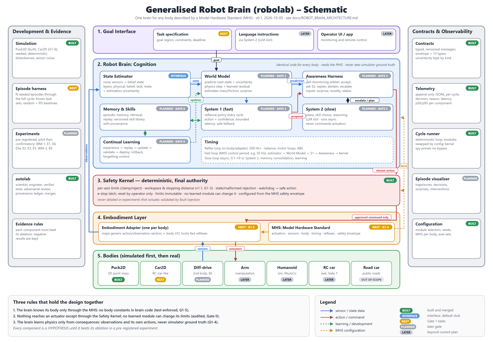

# Robot Brain Architecture (robolab)

_Status: v0.1, 2026-10-05. Sources: `AI_Robotics_Full_Documentation.pdf` (mandate, D20),
`docs/MANDATE.md`, decisions D26-D28. The code lives in `labs/robolab/repo`, built by the
autolab lab (`docs/ARCHITECTURE.md` describes the lab itself, not the brain)._

Evidence labels: everything here is an ENGINEERING_DECISION or a HYPOTHESIS. The north
star (D28), one brain for any body described by a Model Hardware Standard, is a HYPOTHESIS
tested body by body. Every learned component must beat its ablation to stay.

---

## 1. The idea in one picture



_Schematic: `docs/robot_brain.png` / `.svg`, generated by `docs/robot_brain_diagram.py`._

```text
                        ┌─────────────────────────────────────────────┐
   Goal / task ───────► │                 ROBOT BRAIN                 │
   (from operator,      │       (identical code for every body)       │
    task set, or        │                                             │
    future interfaces)  │  ┌────────┐   ┌─────────┐   ┌───────────┐   │
                        │  │ State  │──►│  World  │──►│ Awareness │   │
                        │  │estimator│  │  Model  │   │  Harness  │   │
                        │  └───▲────┘   └────┬────┘   │ (arbiter) │   │
                        │      │             │        └─────┬─────┘   │
                        │      │       ┌─────▼────┐  accept │ escalate│
                        │      │       │ System 1 │◄────────┤         │
                        │      │       │  (fast)  │         │         │
                        │      │       └──────────┘  ┌──────▼─────┐   │
                        │      │                     │  System 2  │   │
                        │      │   Memory & Skills ◄─►  (slow;    │   │
                        │      │   Continual learning│  LLM slot) │   │
                        │      │                     └────────────┘   │
                        └──────┼──────────────────────────┬───────────┘
                               │ observations             │ chosen action
                  ┌────────────┴──────────────────────────▼───────────┐
                  │      SAFETY KERNEL (deterministic, final say)     │
                  │      configured from the MHS safety envelope      │
                  └────────────┬──────────────────────────┬───────────┘
                  ┌────────────┴──────────────────────────▼───────────┐
                  │  EMBODIMENT ADAPTER  ◄── MHS (Model Hardware      │
                  │  maps MHS layouts ↔ body I/O;   Standard: body    │
                  │  hosts body reflexes (balance,  description file) │
                  │  motor loops, ABS)                                │
                  └────────────┬──────────────────────────┬───────────┘
                               │ sensors                  │ actuators
                  ┌────────────┴──────────────────────────▼───────────┐
                  │ BODY: Puck2D | Car2D | (later) diff-drive, arm,   │
                  │ humanoid in sim | (Gate 7) real RC car | ...      │
                  └───────────────────────────────────────────────────┘

   Cross-cutting: Contracts (typed messages) · Telemetry · Experiment harness ·
                  autolab (builds, verifies and tests everything above)
```

Three rules hold the design together:
1. **The brain never knows which body it is in except through the MHS.** No body
   constants in brain code (enforced by test, G1-5).
2. **Nothing reaches an actuator except through the Safety Kernel**, and no learned module
   can change the kernel's limits (G0-3, audited D26).
3. **The brain learns physics only from consequences**: it sees observations and its own
   actions, never the simulator's true state (G1-4, D27).

## 2. Layers

| # | Layer | Contents | Body-specific? |
|---|---|---|---|
| 1 | Goal interface | Task/goal specification (goal region, constraints, deadline). Later: operator UI, voice, LLM instructions. | No |
| 2 | Cognition (the brain) | State estimator, World Model, System 1, System 2, Awareness Harness, Memory & Skills, Continual learning | **No** (reads the MHS) |
| 3 | Safety | Safety Kernel: limits, workspace/operating domain, stopping distance, staleness, watchdog, e-stop | No code; **configured** from the MHS |
| 4 | Embodiment adapter | Translates the brain's generic action/observation vectors to the body's I/O; hosts fast reflexes the MHS declares | Yes (one per body) |
| 5 | Body | Simulator or hardware (via drivers / ROS 2 at Gate 7) | Yes |
| × | Cross-cutting | Contracts, telemetry, experiment harness, evaluation sets, autolab provenance | No |

## 3. Model Hardware Standard (MHS)

A versioned, machine-readable description of a body (spec: G1-5). It is the *only* way the
brain learns what body it has.

| Section | Contents |
|---|---|
| Identity | body name, body class (point_mass, wheeled, legged, ...), MHS version |
| Actuators | name, kind (force, torque, velocity, steering, ...), units, min/max, rate limit, latency; action vector layout |
| Sensors | name, kind, units, shape, rate, noise model, frame; observation layout |
| Body | mass/inertia (or "unknown"), geometry/footprint, frames |
| Control | control period, timing requirements, reflexes the body provides itself |
| Safety envelope | workspace or operating domain, speed limits, braking capability, safe action, e-stop semantics |

Example classes: Puck2D (2 force actuators, position/velocity sensors), Car2D (throttle,
brake, steering; non-holonomic), humanoid (~30 joint torques, balance reflex declared),
road car (operating domain = road rules; out of scope for real-world use).

## 4. Cognitive components

| Component | Job | v1 design (plan) | Output contract | Gate / test |
|---|---|---|---|---|
| **State estimator** | Turn noisy sensor readings into a belief state with uncertainty; layers: physical, belief, task, meta | Filter over MHS sensor layout | `StateUpdate` | interface now (pass-through) |
| **World Model** | Predict next state(s) given state + action, with uncertainty; estimate physical properties (mass, friction) online; its prediction error is the "surprise" signal | Hand-written integrator over object-centric variables + learned residual; fully learned model as comparison (D27) | `PredictionResult` | Gate 2, WM-1, WM-2 |
| **System 1** | Fast reflexive control every cycle, with a confidence output and a safe fallback | Small NumPy MLP or linear policy (ES/CEM training), bounded latency | `ActionProposal` | Gate 3, E1 |
| **Awareness Harness** | Monitor the brain itself; decide: accept S1, request S2, request prediction, replan, abstain, escalate. Inputs: novelty, surprise, stakes, budget, S1 confidence | v1 interpretable rules; learned arbitration is a research question | `AwarenessDecision` | Gate 4, E3a, E3 |
| **System 2** | Slow deliberation: plans, skill selection, long-horizon reasoning. Never commands actuators. The LLM slot (local vs cloud: open decision) | v1 planner over the World Model (search/MPC); LLM as a later condition | `PlanProposal` | Gate 5, E2 |
| **Memory & Skills** | Episodic memory (what happened), retrieval, replay; versioned skills reusable across tasks and, ideally, bodies | Episodic store with provenance; skill library | `MemoryQuery/Result` | Gate 6 |
| **Continual learning** | Improve from experience without forgetting: experience → selection → replay → update → validation → deployment, with rollback and safety gates | Replay + held-out regression checks | `LearningEvent` | Gate 6, E5 |

What is shared across bodies (the "general" part): the *process*: predict, notice
surprise, decide how hard to think, plan, remember, learn, stay safe. What each body
needs: its MHS, its adapter, and a short period of learning its own dynamics.

## 5. The control cycle

One deterministic cycle (implemented: `CycleRunner.step`, G0-4):

```text
kernel.tick(now) → Environment.observe → StateEstimator.estimate → WorldModel.predict
→ System1.propose → [System2.plan if requested] → Awareness.arbitrate
→ SafetyKernel.check → Environment.actuate(kernel output only) → Outcome → Telemetry
```

Timing (two loops, needed before Gate 5):

| Loop | Rate | Members |
|---|---|---|
| Reflex (adapter/body) | body-defined, e.g. 500 Hz+ | balance, motor current loops, ABS |
| Fast (brain) | MHS control period, e.g. 50 Hz | estimator, World Model, S1, Awareness, Safety Kernel |
| Slow (brain) | asynchronous, 0.1-10 s | System 2 (incl. LLM), memory consolidation, learning |

The current runner is synchronous; an asynchronous System 2 lane is tech debt to design
before Gate 5. While S2 thinks, S1 keeps control; S2's plan is applied only if still valid.

## 6. Safety architecture

- **Safety Kernel** (deterministic, no learned parts): per-axis limits (clamp or reject),
  workspace/operating domain, stopping-distance check with a braking safe action (G1-3),
  stale and malformed command rejection, watchdog → safe action, e-stop latch reset only by
  the operator API. Limits are immutable after construction; configured from the MHS.
- **Never ablated** in experiments that actuate; validated by fault injection (sensor
  dropout, stale state, malformed messages, actuator disconnect, component failure, timeouts).
- **Deployment ladder** (mandate): simulation → hardware-in-the-loop → bench → constrained
  motion → supervised low-risk → expanded, each with evidence and rollback. Real hardware
  only by explicit human decision (Gate 7). Public-road driving is out of scope.

## 7. Contracts and observability

- **Messages** (`src/contracts`, G0-1): Envelope (message ID, timestamp, source,
  destination, schema version, cycle ID, correlation ID, payload) + Observation, StateUpdate,
  PredictionRequest/Result, ActionProposal, PlanProposal, AwarenessDecision, SafetyDecision,
  Outcome, LearningEvent, MemoryQuery/Result, ExperimentEvent. Uncertainty kept separate by
  kind: measurement, estimation, model, policy, outcome. MHS joins in G1-5.
- **Telemetry** (G0-2): append-only JSONL per cycle (component, decision, reason, latency,
  model version); per-component p50/p95 latency; size cap.
- **Planned:** episode visualiser (trajectories, decisions, surprises) after G1-2.

## 8. Simulation and evaluation

- **Bodies:** Puck2D (built, G1-1), Car2D (G1-6), then differential drive (E6), arm, and
  legged/humanoid in a heavier simulator (MuJoCo, by recorded decision).
- **Harness** (G1-2): N seeded episodes through the full cycle; metrics: success, time,
  path length, collisions, safety interventions, compute; frozen JSON evaluation sets with
  held-out splits; reference policies (random, PD).
- **Experiments** (autolab research track, pre-registered, pilot → confirmatory):
  WM-1, E1, E4, E3a, E2, E3, E5, WM-2, E6 (see `docs/PROJECT_PLAN.md`).

## 9. Code map (robolab `src/`)

| Package | Contents | Status |
|---|---|---|
| `contracts/` | messages, envelope, validation; MHS (G1-5) | built (G0-1) |
| `state/` | telemetry; state estimators | telemetry built (G0-2) |
| `safety/` | Safety Kernel | v1 built (G0-3); v1.1 G1-3 |
| `robot/` | cycle runner, module protocols, config-based module loading | built (G0-4) |
| `simulation/` | Puck2D; harness, policies, eval sets (G1-2); Car2D (G1-6) | Puck2D built (G1-1) |
| `world_model/` | World Model | empty (Gate 2) |
| `system1/` | fast policy | empty (Gate 3) |
| `awareness/` | arbiter | empty (Gate 4) |
| `system2/` | planner / LLM | empty (Gate 5) |
| `memory/`, `skills/`, `learning/` | episodic memory, skills, continual learning | empty (Gate 6) |
| _adapters_ | embodiment adapters per body | to add with G1-5/G1-6 |

## 10. Build order and status

| Gate | Content | Status |
|---|---|---|
| 0 | contracts, telemetry, Safety Kernel, cycle runner | **PASSED** (D26) |
| 1 | Puck2D; harness; kernel v1.1; ground-truth isolation; MHS v0; Car2D | G1-1 done; G1-2..G1-6 next |
| 2 | World Model (WM-1, WM-2) | planned |
| 3 | System 1 (E1 baseline: the first milestone) | planned |
| 4 | Awareness (E3a, E4) | planned |
| 5 | System 2 incl. LLM condition (E2, E3); async lane | planned |
| 6 | memory, skills, continual learning (E5) | planned |
| 7 | hardware (first candidate: real RC car) | deferred, human decision |
| 8 | research evaluation; cross-body transfer E6 synthesis | planned |

## 11. Open questions

1. Local vs cloud LLM for System 2 (human, by Gate 5).
2. What representation is shared across bodies (ADR-005: experimental, not assumed).
3. How much physics is learned vs given (D27: progressively, each step earned).
4. Which reflexes belong below the adapter for legged bodies.
5. First real body (Gate 7).
